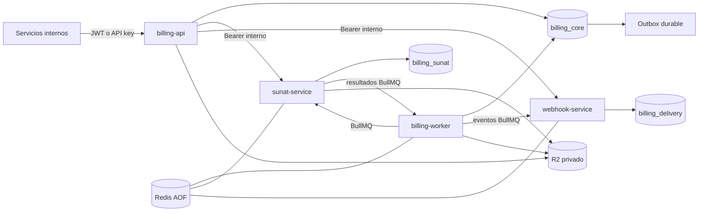

# Arquitectura de la plataforma fiscal

## Límites de servicio

- `billing-api` es el único ingreso público. Autentica, deriva el tenant de la
  credencial y administra emisores, series, cuentas de servicio y API keys.
- `billing-worker` publica el outbox, aplica resultados mediante inbox idempotente
  y genera PDF/QR después de una aceptación.
- `sunat-service` posee credenciales SOL/certificados cifrados, UBL, firma,
  envíos, conciliación, CDR y sincronización de recibidos.
- `webhook-service` posee suscripciones y secretos HMAC cifrados, además de cada
  intento, lease y dead letter.

Cada servicio posee su esquema y usuario PostgreSQL. No hay joins ni claves
foráneas entre bases: los límites se comunican con contratos versionados y
referencias inmutables de objetos.

## Flujo de emisión

1. El cliente envía el comprobante con `Idempotency-Key`.
2. Core valida el grant del emisor, calcula importes con decimales exactos y, en
   una transacción `SERIALIZABLE`, reserva el correlativo, guarda el snapshot y
   crea un evento outbox.
3. El worker guarda el snapshot canónico en R2 con SHA-256 y publica un comando
   BullMQ cuyo `jobId` estable es el `eventId`.
4. SUNAT reclama el comando en su ledger, construye UBL y guarda artefactos. Un
   resultado versionado vuelve a Core.
5. Core aplica el resultado una sola vez mediante inbox, registra la transición y
   solicita PDF/webhooks por nuevos eventos outbox.

La sincronización de recibidos usa el mismo límite transaccional: su
`Idempotency-Key` es única por organización y emisor, y el hash de una solicitud
normalizada detecta reutilizaciones con otro payload. Cada fila efectivamente nueva
crea `received-document.imported.v1` en el outbox; un `ON CONFLICT DO NOTHING` evita
eventos duplicados para documentos ya importados.

`fiscal-document.processing.v1` se crea en la misma transacción que mueve el
comprobante de `queued` a `processing`. Si un resultado SUNAT gana la carrera contra
la confirmación del publicador, el procesador de inbox realiza esa transición y crea
el mismo evento, de modo que sólo el actor que cambia el estado lo emite.

La entrega es al menos una vez; la corrección proviene de idempotencia, IDs
estables, locks con vencimiento y restricciones únicas. Los objetos R2 usan claves
por hash y `If-None-Match: *`, por lo que una carrera no puede sobrescribirlos.

## Seguridad

- Una API key tiene forma `bill_live_<prefix>.<secret>`; sólo se persiste su HMAC
  con pepper a largo plazo. La creación es transaccional e idempotente: una copia
  de respuesta cifrada con otra clave admite reintentos durante una ventana corta;
  luego se purga el cifrado y queda sólo el tombstone de idempotencia.
- Todas las mutaciones administrativas escriben el recurso y su auditoría en una
  misma transacción; si falla el audit log, también se revierte el cambio.
- El tenant nunca se acepta desde un header o body de una operación normal: se
  deriva del JWT/API key y los grants limitan emisores por cuenta de servicio.
- Credenciales SUNAT y secretos webhook se cifran con AES-256-GCM y contexto AAD.
- Los artefactos permanecen privados; la API emite URLs de lectura breves.
- Sólo la API se publica en loopback. Los endpoints administrativos internos usan
  un Bearer compartido montado como secret y las bases emplean usuarios distintos.

## Modos operativos

- `mock`: no realiza red ni firma válida y no tiene validez fiscal. En Compose de
  desarrollo conserva ledger/journal en PostgreSQL y comparte R2 para probar el
  flujo distribuido completo.
- `production`: selecciona únicamente adaptadores durables y falla cerrado. El
  transporte directo y la firma permanecen deliberadamente no-ready hasta ser
  validados con certificados, XSD/catálogos y fixtures oficiales de SUNAT; no se
  simula una capacidad productiva inexistente.

## Evolución

El monorepo permite desplegar los cuatro procesos por separado hoy. Si el volumen
lo exige, las siguientes divisiones naturales son un servicio de renderizado y un
servicio dedicado de recepción. Fiscal Domain y Contracts deben seguir siendo
paquetes puros; las reglas de negocio no deben depender de NestJS, TypeORM, Redis
ni R2.
