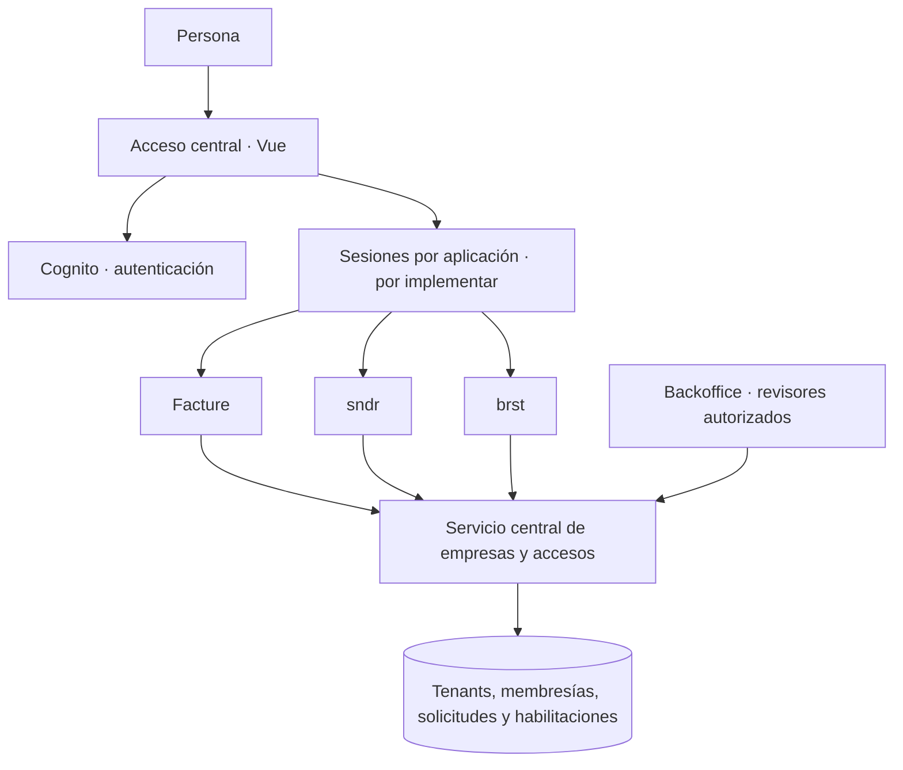

# Identidad, empresas y acceso compartido

**Estado:** arquitectura objetivo acordada para orientar la implementación. Los nombres de servicios y contratos son propuestas; no describen componentes ya desplegados. La sección «Situación actual» identifica lo que existe hoy.

**Revisión de acuerdos: 26 de septiembre de 2026.** Esta etapa documenta el funcionamiento deseado y sus decisiones pendientes. No implica haber migrado bases, integrado productos, actualizado paquetes ni activado Dependabot.

## Alcance confirmado: inicio de sesión unificado

Esta etapa entrega una cuenta personal y un acceso central compartido para Facture, sndr y brst. No incluye construir gestión de integrantes, nuevos sistemas de roles ni conexiones operativas entre productos. Las secciones de arquitectura ampliada se conservan como referencia futura y no amplían este alcance.

- Cada producto inicia el acceso central mostrando el producto de destino y recibe de vuelta a la persona. Con una sesión central vigente, no vuelve a pedir credenciales salvo que la política de autenticación lo requiera.
- La cuenta pertenece a la persona, no a una empresa. Se conserva aunque participe en otras empresas o cree su propio negocio.
- Un tenant equivale a una empresa con identidad legal común. Las sucursales de brst pertenecen a esa empresa; no se diseña aquí su gestión.
- Para iniciar el onboarding de un producto se muestran únicamente empresas donde la persona es owner. También puede registrar una empresa nueva.
- Una empresa ya verificada reutiliza esa verificación en todos los productos. Su owner completa el onboarding y la configuración propia del producto y puede empezar a usarlo, sin otra verificación ni aprobación comercial manual por producto.
- Una empresa pendiente solo dispone de un sandbox con características básicas de prueba. El aislamiento, los límites y la transición a producción deben concretarse técnicamente; no se presupone que este sandbox ya exista ni que conecte productos.
- El backoffice conserva la revisión común de la empresa y su administración. La decisión anterior de exigir habilitación comercial manual para cada producto queda sustituida por la activación del owner mediante onboarding.
- Habrá cierre de sesión local del producto y una opción explícita de cierre global de la suite.

Los permisos existentes se respetan. Compartir identidad no concede acceso a datos de otra empresa. La diferenciación por producto y la comprobación de que la persona es owner para el onboarding son necesarias, pero no implican crear una consola de integrantes ni migrar ahora todos los roles de brst.

## Visión futura de la suite

Una persona utiliza una sola cuenta para acceder a Facture, sndr y brst. La identidad de la empresa y su verificación se reutilizan sin registrar la misma empresa de nuevo en cada aplicación. A futuro, los productos podrán conectarse para gestionar pedidos, emitir comprobantes y enviarlos; esos recorridos no se planifican ni implementan en esta etapa.

La empresa no tiene una contraseña compartida: cada persona entra con su cuenta personal. Autenticar a una persona, comprobar la existencia de una empresa y acreditar que puede administrarla son decisiones distintas.

## Decisiones técnicas confirmadas e implementación inicial

Cognito permanece como autoridad de autenticación. El acceso central es un proyecto Vue + NestJS en repositorio propio, con dominio y despliegue independientes de los productos. La suite se organiza en servicios independientes; los backends propios usan NestJS. La interfaz central es custom, no Managed Login.

Existe una primera implementación local en el repositorio hermano `../platform-identity`: proveedor OIDC mantenido, interacción Vue/Cognito, persistencia propia y pruebas de SSO. Facture dispone de integración opcional. sndr, brst y la reutilización empresarial todavía requieren adaptación; no hay despliegue ni migración de producción. Véase el [estado técnico actualizado](shared-platform-sso.md).

## Arquitectura de referencia de la plataforma

| Componente | Responsabilidad |
| --- | --- |
| Cognito | Directorio de usuarios, credenciales, verificación de correo, recuperación y factores de autenticación. |
| Acceso central con interfaz Vue | Experiencia de acceso y establecimiento de sesiones para los productos mediante un protocolo común. El SSO entre aplicaciones todavía debe implementarse. |
| Servicio central de empresas y accesos | Tenants, identidad legal, solicitudes, membresías, productos habilitados y registro de decisiones. Fuente de verdad compartida. |
| Backoffice independiente | Interfaz interna para revisar solicitudes, comprobar representación, administrar accesos y resolver reclamaciones. Consume el servicio central; no mantiene un segundo registro de empresas. |
| Facture | Emisores, series, credenciales SUNAT, comprobantes y permisos de facturación. |
| sndr y brst | Datos, operaciones y permisos propios de cada producto. Su integración deberá adaptarse al contrato común. |

El backoffice tendrá una aplicación Vue y un despliegue propios. La separación de interfaz no sustituye la autorización en servidor. Inicialmente puede vivir en un monorepositorio; separar aplicaciones no obliga a crear repositorios distintos.

El núcleo central tendrá una base de datos de su propiedad. Los productos lo consumirán mediante contratos de API y eventos, sin escribir directamente en sus tablas ni compartir entidades ORM entre servicios.

El acceso central/SSO y la gestión central de empresas son responsabilidades independientes. Una persona puede autenticarse sin tener una empresa aprobada. Cada producto podrá iniciar el acceso común y recibir de vuelta al usuario; entrar primero al portal central no será obligatorio. La interfaz central es Vue custom en un repositorio independiente. NestJS integra Cognito con `oidc-provider`; la incorporación de los productos se verifica por separado.

### Registro desde cada producto, verificación compartida

sndr, brst y Facture podrán presentar sus propios formularios de registro de empresa y seguimiento de solicitudes. Sus backends consumirán el mismo servicio central, que será autoridad sobre identidad legal, representación y decisiones. El backoffice central revisará las solicitudes independientemente del producto de origen.

Cada solicitud y decisión conservará producto de origen, solicitante, empresa objetivo cuando exista, alcance verificado, actor que decide, versión del criterio, fecha, referencia de evidencia y vencimiento cuando corresponda. El backend autentica al cliente e identifica el origen; un campo enviado por el navegador no otorga confianza ni privilegios.

Una empresa aprobada puede reutilizar su verificación en otros productos según el alcance y vigencia acreditados, siempre comprobando el acceso de la persona. La preparación fiscal de Facture y los requisitos operativos de sndr o brst permanecen en cada producto. No habrá tres registros independientes de aprobación de la misma identidad legal.

### Bases existentes y autonomía

Se conservarán las bases operativas de cada producto. Centralizar empresas y membresías no implica reunir conversaciones, pedidos, inventario y comprobantes en una sola base, ni convertir ahora todas las bases a esquemas.

| Límite | Decisión |
| --- | --- |
| Propiedad de datos | El núcleo es autoridad sobre datos comunes; cada producto mantiene sus operaciones y migraciones. |
| Infraestructura física | Se puede evaluar compartir una instancia con varias bases y roles separados. No está decidido ni es requisito del SSO. |
| Acceso a datos comunes | API del núcleo y eventos; sin escrituras directas de productos en sus tablas. |
| Copias locales | Solo los datos necesarios, con versión, reconciliación y plazo de vigencia explícitos. |
| Independencia | Interfaz, backend y despliegue por producto; no equivale a disponibilidad total si falla el núcleo. |

Ante una caída del núcleo, las nuevas verificaciones y cambios de membresía quedan pendientes. Las operaciones existentes solo podrán continuar dentro de una política explícita de vigencia de autorizaciones; vencida o desconocida esa información, se deniega la operación protegida. Deben acordarse el plazo máximo de revocación y las operaciones que requieren consulta vigente.

La empresa activa es contexto de cada sesión de producto. Cambiarla en sndr no cambiará silenciosamente una pestaña de Facture. En Facture se preservan los datos históricos de los comprobantes aunque cambie la información central de la empresa.

## Modelo de datos conceptual

Los siguientes recursos son el contrato objetivo, no tablas disponibles actualmente.

| Recurso | Datos principales | Regla |
| --- | --- | --- |
| Cuenta | `user_id`, proveedor, `issuer`, `subject` | La identidad externa se vincula por emisor y sujeto de Cognito. El correo es un atributo, no una clave para fusionar cuentas. |
| Tenant | `tenant_id`, nombre, tipo, estado operativo | UUID estable compartido por los productos. No usar el RUC como identificador técnico. |
| Identidad legal | tenant, país, tipo y número de identificación, razón social, estado de verificación | Inicialmente una empresa legal por tenant empresarial. La unicidad de una identidad aprobada se define por país, tipo y número. |
| Solicitud | solicitante, datos declarados, empresa objetivo si corresponde, estado | Registrar una solicitud no reserva un RUC ni otorga acceso. |
| Verificación de representación | solicitante, empresa, alcance autorizado, revisor, referencia de evidencia | Verificar la empresa no acredita automáticamente a todos sus solicitantes. |
| Membresía | usuario, tenant, estado, función de administración del espacio | Una persona puede pertenecer a varios tenants. Una invitación pendiente no es una membresía activa. |
| Habilitación de producto | tenant, producto, estado | La verificación se reutiliza; el owner activa cada producto mediante su onboarding, sin aprobación manual adicional. |
| Permisos de producto | usuario o membresía, tenant, producto, roles | Los roles tienen significado dentro del producto; no reutilizar un `admin` global ambiguo. |
| Auditoría | actor, acción, recurso, fecha, resultado y motivo | Conservar la trazabilidad de aprobaciones, rechazos, concesiones y revocaciones. |

El núcleo central publica la membresía y la habilitación del producto. Cada producto define y aplica sus permisos de operaciones. Si se ofrece asignación de esos permisos desde una consola común, se hace mediante el contrato del producto, con su validación; no con dos fuentes de verdad independientes.

El administrador de un tenant puede gestionar su espacio según facultades explícitas. Esa condición no concede por sí sola permisos fiscales, permisos en todos los productos ni rol de revisor de plataforma. Tampoco debe permitir asignar privilegios fuera de su autoridad.

Para brst queda por confirmar si todos los usuarios trabajan con empresas. El modelo podrá admitir espacios personales o equipos sin identidad fiscal, pero no se activará esa modalidad por inferencia. No se exigirá un RUC para autenticar a una persona.

### Tenant y emisor fiscal

El tenant representa el espacio de la empresa en la plataforma. El emisor es una configuración de Facture asociada a ese tenant. Aprobar una empresa en el núcleo no debe crear automáticamente series ni credenciales fiscales.

Una empresa puede usar solo sndr o brst. Al habilitar Facture se inicia su configuración fiscal específica. La pertenencia a un tenant no permite consultar comprobantes de otro, aunque ambos pertenezcan al mismo usuario.

## Registro, validación y acceso

1. La persona crea o utiliza su cuenta y verifica su correo mediante Cognito.
2. Solicita registrar una empresa o incorporarse a una empresa existente. El autocompletado de RUC ayuda a capturar datos públicos; no acredita representación.
3. El servicio central guarda un borrador o una solicitud pendiente. No concede permisos ni bloquea al titular de un RUC por orden de llegada.
4. Un revisor autorizado accede al backoffice, contrasta la identidad legal y comprueba independientemente las facultades del solicitante.
5. Puede pedir información, rechazar con un motivo o aprobar el alcance acreditado. La aprobación y la concesión de membresía se registran de forma consistente y auditada.
6. El owner activa explícitamente el producto mediante onboarding y completa su configuración específica. No se requiere otra aprobación manual del backoffice por producto.
7. La persona selecciona una empresa y entra a los productos para los que tiene acceso efectivo.

**Estados objetivo de solicitud:** borrador, pendiente, requiere información, aprobada y rechazada. El estado «requiere información» y el intercambio seguro de evidencia aún no están implementados.

El estado de verificación de la identidad legal se separa del estado operativo del tenant: una empresa puede seguir verificada y estar suspendida. Revocar una membresía tampoco modifica por sí mismo la identidad de la empresa.

Si ya existe una empresa aprobada, una nueva solicitud no crea otra empresa ni transfiere su administración. El acceso se resuelve con invitación de un administrador facultado o mediante una reclamación revisada. Conocer el RUC, controlar un correo o aportar una ficha pública no basta para obtener control del tenant.

## Backoffice y revisores

El backoffice es un producto interno de plataforma, separado de los paneles de las empresas. Su primera entrega deberá incluir cola de solicitudes, detalle, referencias de evidencia, solicitud de información, decisión motivada e historial.

El rol de revisor se asignará explícitamente a una identidad estable, con auditoría y posibilidad de revocación. No se concederá por registrarse, por pertenecer a una empresa ni solo por coincidencia de correo. Un revisor no aprobará su propia solicitud. Acciones de recuperación o transferencia de propiedad requerirán un procedimiento específico; no deben resolverse editando directamente una membresía.

Antes de operar con evidencia sensible se debe definir el canal de recepción, acceso, retención y eliminación. Los logs y las notas visibles al solicitante no deben contener contraseñas, documentos completos ni evidencia privada de terceros. Las notificaciones y sus destinatarios también deben configurarse; «en revisión» no implica que ya se haya enviado un correo.

## Una cuenta no equivale a SSO

Compartir el user pool permite reutilizar la identidad. El inicio de sesión único requiere además un mecanismo para establecer sesiones en aplicaciones y dominios diferentes.

El contrato objetivo es: una aplicación inicia el acceso central, recibe un resultado destinado exclusivamente a ella y crea su propia sesión protegida. El usuario cambia de producto sin repetir credenciales mientras su sesión central y las políticas de acceso lo permitan.

El mecanismo elegido es un proveedor OIDC mantenido dentro del servicio central NestJS, que autentica con Cognito y presenta la interfaz Vue propia. El formulario nativo previo de Facture no establecía SSO; ahora existe una adaptación opcional al issuer central. Managed Login no es la interfaz elegida. El estado de implementación y sus límites están en `shared-platform-sso.md`.

Para un flujo por redirecciones, exigir destinos registrados, códigos de un solo uso, expiración corta, validación de estado y PKCE cuando corresponda. Cada aplicación valida emisor y audiencia y conserva su sesión en cookie HttpOnly. No transportar sesiones ni tokens duraderos en URLs, compartir contraseñas entre servicios, compartir una cookie amplia entre productos o crear un protocolo propio de autenticación sin revisión.

También deben definirse el cierre de sesión local frente al global, renovación, vencimiento, MFA y recuperación. El acceso del backoffice debe tener una política acorde a sus privilegios.

## Contratos entre núcleo y productos

El contrato común deberá permitir, como mínimo:

- Identificar al usuario y consultar sus membresías activas.
- Obtener el tenant seleccionado y sus habilitaciones de productos.
- Registrar y consultar solicitudes; revisar y auditar decisiones.
- Invitar, aceptar, suspender y revocar membresías con autorización explícita.
- Publicar cambios de tenant, membresía y habilitación con versiones y eventos idempotentes.

Nombres orientativos de eventos: `tenant.verified`, `membership.granted`, `membership.revoked` y `product.access.changed`. No son eventos implementados ni esquemas definitivos.

En cada operación, el producto comprueba identidad válida, tenant operativo, membresía activa, producto habilitado y permiso específico. El `tenant_id` recibido del navegador es contexto solicitado, no prueba de autorización. Sus consultas, archivos y trabajos en segundo plano mantienen el aislamiento por tenant.

Las integraciones entre servicios usan credenciales de servicio y alcances explícitos; no contraseñas de usuarios ni un token universal. Si se mantienen copias locales de membresías o habilitaciones, debe existir un límite de antigüedad y un mecanismo de revocación. Los eventos por sí solos no garantizan revocación inmediata: hay que definir y probar el plazo máximo. Ante autorización desconocida o vencida, denegar la operación protegida.

### Conexiones entre productos — fuera del alcance actual

Se propone registrar conexiones por tenant, servicio origen, servicio destino, operaciones permitidas, estado y actor autorizador. Tener dos productos habilitados no autoriza por sí solo el intercambio de todos sus datos. Falta definir quién puede conceder estas conexiones y sus contratos exactos.

Las APIs recibirán solicitudes de acción; los eventos comunicarán resultados. Por ejemplo, una conexión autorizada podría permitir a sndr solicitar una emisión en Facture. Facture valida autorización y reglas fiscales, evita duplicados con una clave de idempotencia y publica el resultado. brst solo lo recibe si su conexión y alcance lo permiten. Este ejemplo es objetivo, no una integración implementada.

Cada mensaje debe llevar contexto de tenant, identidad del emisor, identificador de evento/operación y versión del contrato. Definir entrega confiable, reintentos, deduplicación, tratamiento de errores y reconciliación. La autorización debe aplicarse también a consumidores y trabajos en segundo plano.

## Situación actual

| Capacidad | Estado actual |
| --- | --- |
| Cuenta y autenticación Cognito | Integradas en Facture, con login Vue y alternativa gestionada. |
| Sesión del navegador | BFF de Facture, cookie HttpOnly y sesión local de duración limitada. |
| Empresas y membresías | Residen todavía en la base de Facture como organizaciones y membresías. |
| Solicitudes | Formulario Vue, borradores, envío y decisión administrativa por API. |
| Padrón RUC | Copia oficial local para autocompletar, con fecha de fuente; no acredita representación. |
| Aprobación actual | Crea organización, owner, emisor y serie juntos. Este acoplamiento fiscal debe separarse al extraer el núcleo. |
| Backoffice independiente | Pendiente. No hay panel ni asignación de revisor web implementados. |
| SSO entre productos | Pendiente. El login Vue de Facture no establece una sesión común con sndr o brst. |
| Integración de sndr y brst | Pendiente de inventariar y migrar identidades, empresas y permisos de cada producto. |

Las empresas existentes no se consideran verificadas retroactivamente por tener datos en una tabla. Los espacios provisionales de desarrollo tampoco acreditan una identidad legal.

### Inventario inicial de repositorios

Inspección local del 26 de septiembre de 2026. Describe configuraciones versionadas, no verifica instancias ni versiones efectivamente desplegadas.

| Producto | Ubicación respecto de este repositorio | Persistencia configurada | Modelo actual |
| --- | --- | --- | --- |
| sndr | `../back` y `../front` | PostgreSQL 16, servicio propio en Compose | Autenticación propia, empresas y membresías; operaciones de WhatsApp. |
| brst | `../../brst/web` | PostgreSQL 18; Compose principal fija 18.6 | Better Auth, cuentas empresariales, membresías y locales; operaciones de restaurante. |
| Facture | Este repositorio | PostgreSQL 16; una instancia con `billing_core`, `billing_sunat` y `billing_delivery` | Cognito, organizaciones, membresías y dominio fiscal. |

Fuentes: `../back/src/config/database.config.ts`, `../back/deploy/docker-compose.prod.yml`, `../back/README.md`, `../../brst/web/AGENTS.md`, `../../brst/web/apps/backend/docker-compose.yml`, `compose.yaml` y `deploy/postgres/001-create-billing-databases.sh`. Las rutas hermanas corresponden al espacio local y no son enlaces portables entre repositorios.

Antes de migrar, confirmar entornos reales, tamaño, carga, extensiones, versiones, respaldos y responsables. Mapear empresas de sndr, cuentas/locales de brst y organizaciones/emisores de Facture; no asumir equivalencia uno a uno. Los locales de brst conservan su significado operativo.

## Mantenimiento de PostgreSQL y dependencias

### Objetivo de versiones

Prioridad acordada: llevar los productos a la última versión estable de PostgreSQL y mantener paquetes, runtimes e imágenes actualizados. La adopción debe validar compatibilidad; no se usarán betas ni una etiqueta flotante `latest` como mecanismo de actualización de producción.

Según la [política oficial de PostgreSQL](https://www.postgresql.org/support/versioning/), consultada el 26 de septiembre de 2026, la referencia estable es **18.6**; PostgreSQL 19 está en beta. Esto fija una referencia de planificación, no una versión perpetua: se comprobará la estable vigente al ejecutar el trabajo. sndr y Facture requieren evaluar el salto desde 16; brst ya declara 18.6 en su Compose principal, pendiente de verificar despliegue.

Para actualizaciones mayores, preparar inventario de extensiones y drivers, respaldo con restauración comprobada, ensayo sobre copia, método de migración (`pg_upgrade` o exportación/restauración), pruebas de la aplicación y ventana de cambio. Cambiar únicamente la etiqueta del contenedor no migra el directorio de datos. Registrar el punto de corte y cómo se recuperarán las escrituras posteriores si hay que revertir; volver a una imagen anterior no es una reversión suficiente.

Mantener el parche vigente de la versión mayor elegida, revisando sus notas. Alinear desarrollo, CI y producción con versiones explícitas e imágenes reproducibles. Cada actualización debe comprobar migraciones, aislamiento por empresa y flujos críticos del producto. La consolidación física de instancias se evaluará separadamente, después de conocer carga, disponibilidad y recuperación requeridas.

### Actualización continua con Dependabot

Se plantea Dependabot por repositorio para proponer actualizaciones mediante PR. La configuración efectiva y su cobertura actual deben inventariarse antes de activarlo; este documento no afirma que esté habilitado.

- Cubrir paquetes de aplicación y desarrollo, imágenes de contenedor y GitHub Actions. Inventariar manifiestos, lockfiles, Dockerfiles y Compose, verificando el soporte de cada ubicación y ecosistema.
- Propuesta inicial: revisión semanal de versiones, grupos pequeños de cambios compatibles y tratamiento prioritario de alertas de seguridad. Los cambios mayores se revisan por separado.
- Mantener coherencia entre runtime, gestor de paquetes, framework, ORM y drivers. En clientes móviles respetar la matriz de compatibilidad de Expo/React Native.
- Exigir instalación reproducible, compilación y controles de CI relevantes; probar especialmente autenticación, autorización, migraciones e integraciones cuando se vean afectadas.
- La automatización inicial crea PR; no implica fusión ni despliegue automáticos. Una política futura de auto-merge para cambios de bajo riesgo queda pendiente de acordar y de disponer de checks obligatorios.
- Las actualizaciones mayores de PostgreSQL requieren el procedimiento operativo anterior, aunque el cambio de imagen llegue mediante un bot.

Referencia: [opciones de Dependabot](https://docs.github.com/en/code-security/reference/supply-chain-security/dependabot-options-reference). La cadencia, agrupación y ubicaciones se concretarán en cada repositorio. Las excepciones de versión tendrán motivo, responsable y fecha de revisión para evitar bloqueos indefinidos.

## Plan de la etapa actual

1. **Inventario técnico de autenticación:** comprobar cómo inician y mantienen sesión Facture, sndr y brst; identificar clientes, dominios, callbacks y cuentas existentes. No migrar aún integrantes ni permisos.
2. **Diseño del acceso central:** elegir el mecanismo estándar de SSO compatible con Cognito y la experiencia visual deseada. Definir sesiones por producto, renovación, expiración, cierre local y global, y mapeo seguro de identidades existentes.
3. **Contrato mínimo de empresa:** concretar cómo consultar las empresas de una persona, acreditar su condición de owner y reutilizar la verificación. Definir activación mediante onboarding y sandbox para empresas pendientes, sin extraer por anticipado toda la plataforma futura.
4. **Primer recorrido entre dos productos:** implementar y verificar acceso central, retorno al producto solicitado y cambio de producto sin repetir credenciales. Incluir selección de empresa y onboarding conforme al alcance confirmado.
5. **Incorporar el tercer producto:** adaptar el contrato comprobado y verificar aislamiento, expiración y ambos cierres de sesión entre los tres productos.

El siguiente paso es el inventario y la decisión técnica de SSO, antes de implementar redirecciones o migrar cuentas. Compartir únicamente un user pool no satisface el criterio de inicio de sesión único.

Las integraciones operativas, la gestión central de integrantes, la migración general de roles, la consolidación de bases y las actualizaciones de PostgreSQL/Dependabot son líneas separadas. No son requisitos de entrega de esta etapa.

### Decisiones técnicas pendientes de esta etapa

- Mecanismo de SSO, dominios y clientes que se integrarán; compatibilidad con la interfaz Vue.
- Mapeo de cuentas existentes sin fusionarlas automáticamente por correo.
- Duración, renovación y revocación de sesiones; comportamiento comprobable del cierre local y global.
- Autoridad y contrato mínimo para consultar empresa, owner, verificación y activación de producto.
- Aislamiento y capacidades básicas del sandbox, y transición a producción sin convertir operaciones de prueba en reales.
- Orden de incorporación de productos y estrategia de transición y recuperación.

### Evolución futura fuera de esta etapa

La arquitectura ampliada contempla extraer el núcleo central, ampliar el backoffice, centralizar membresías y conectar operaciones entre productos. Se conserva a continuación su lista de asuntos pendientes como referencia, sin comprometer su implementación actual.

### Decisiones pendientes de la arquitectura ampliada

- Elegir mecanismo de SSO, dominios, clientes web/móviles, renovación y logout; resolver cómo conservar la experiencia Vue.
- Definir el mapeo de identidades existentes, empresas, cuentas, locales y emisores, incluyendo conflictos y recuperación de acceso.
- Concretar criterios/evidencias de verificación, vigencia, reutilización y requisitos propios de cada producto.
- Definir permisos de revisores y administradores para conceder productos, membresías y conexiones.
- Acordar disponibilidad del núcleo, vigencia de copias locales y plazo máximo de revocación.
- Diseñar contratos de integración y operación de eventos sin fijar todavía un proveedor de mensajería.
- Verificar infraestructura real y decidir si conservar instancias o consolidarlas manteniendo bases separadas.
- Preparar actualización de PostgreSQL, cobertura de Dependabot, checks y responsables de mantenimiento.

### Migración sin apropiaciones ni pérdida de historial

Mantener mapas explícitos de `organization_id` y usuarios antiguos hacia los identificadores centrales. Preservar identificadores existentes cuando resulte viable; reconciliar duplicados mediante revisión. No fusionar usuarios por correo ni empresas solo por RUC sin resolver previamente su representación y conflictos.

Conservar trazabilidad de procedencia y permitir un corte por producto con reversión planificada. Los snapshots de comprobantes históricos no se reescriben por cambios posteriores de nombre, domicilio o membresía. Durante la transición, documentar qué sistema es autoridad para cada dato y cuándo deja de aceptar escrituras el anterior.

## Criterios de aceptación de la etapa actual

- Una cuenta inicia sesión en los tres productos mediante acceso central, con el destino identificado y retorno correcto.
- Cambiar de producto reutiliza la sesión central vigente sin repetir credenciales.
- El onboarding permite elegir empresas donde la persona es owner o registrar una nueva.
- Una empresa verificada se reutiliza sin nueva revisión ni aprobación comercial por producto.
- Una empresa pendiente solo accede a las capacidades de prueba acordadas.
- El cierre local y el cierre global cumplen sus respectivos alcances.
- Compartir sesión no concede acceso a empresas ajenas ni altera los permisos existentes.
- No se incorpora gestión de integrantes ni conexiones operativas como requisito de esta entrega.

## Criterios de referencia para la arquitectura ampliada

- Una cuenta accede a dos empresas sin mezclar datos ni permisos.
- La misma empresa conserva su `tenant_id` al habilitar Facture, sndr y brst.
- Una empresa puede operar en un producto no fiscal sin registrar emisor ni serie.
- Un usuario no obtiene acceso por alterar el `tenant_id`, reclamar un RUC o ser administrador de otro producto.
- Solo revisores autorizados resuelven solicitudes; no pueden autoaprobarse y toda decisión queda auditada.
- Suspensión y revocación se aplican en todos los productos dentro del plazo acordado.
- El SSO funciona entre clientes y dominios reales, incluyendo expiración y cierre de sesión; no solo dentro de una pestaña de Facture.
- La migración conserva documentos, membresías justificadas y trazabilidad, sin conceder verificación implícita a registros antiguos.
- Una solicitud iniciada en cualquiera de los productos llega al mismo servicio de verificación y conserva su origen y alcance.
- Una verificación reutilizable evita repetir el proceso común, sin conceder acceso ni preparación fiscal automáticamente.
- Las conexiones entre productos limitan operaciones por tenant y toleran reintentos sin duplicar efectos.
- Cada producto conserva sus datos operativos y puede desplegarse de forma independiente dentro de los contratos acordados.
- Las versiones efectivas de PostgreSQL quedan inventariadas; su actualización tiene ensayo de migración, restauración comprobada y validación de flujos críticos.
- Dependabot cubre las dependencias acordadas mediante PR y CI, con excepciones y responsabilidad de revisión documentadas.

## Documentación relacionada

- [Inventario técnico y propuesta de SSO](shared-platform-sso.md).

- [Arquitectura fiscal actual](architecture.md).
- [Registro de empresas implementado en Facture](company-registration.md).
- [Identidad Cognito y login actuales](../deploy/identity/README.md).
- [Operación del padrón de SUNAT](sunat-padron.md).
